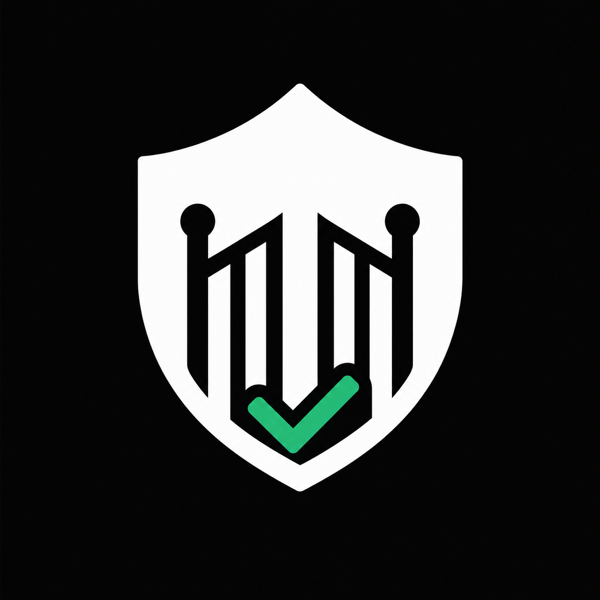
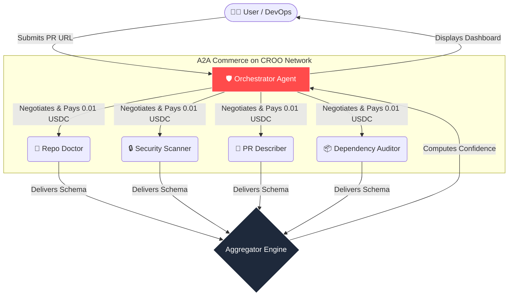
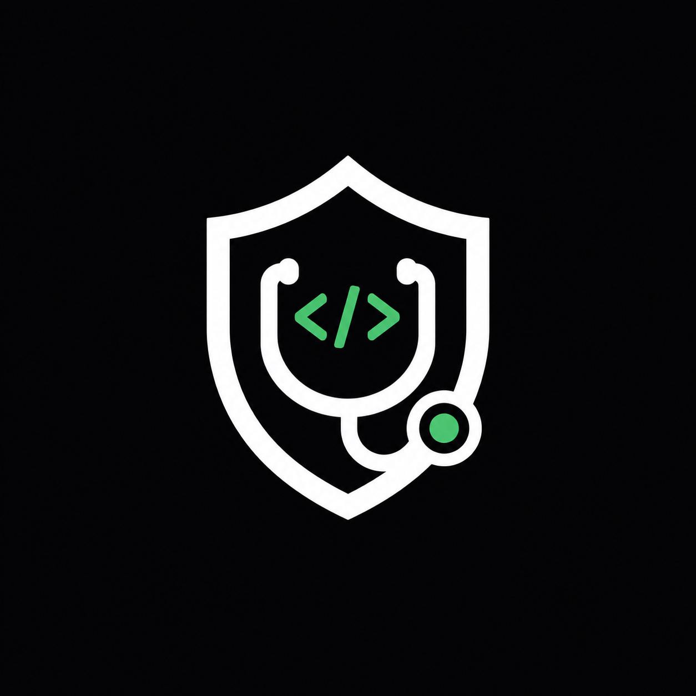
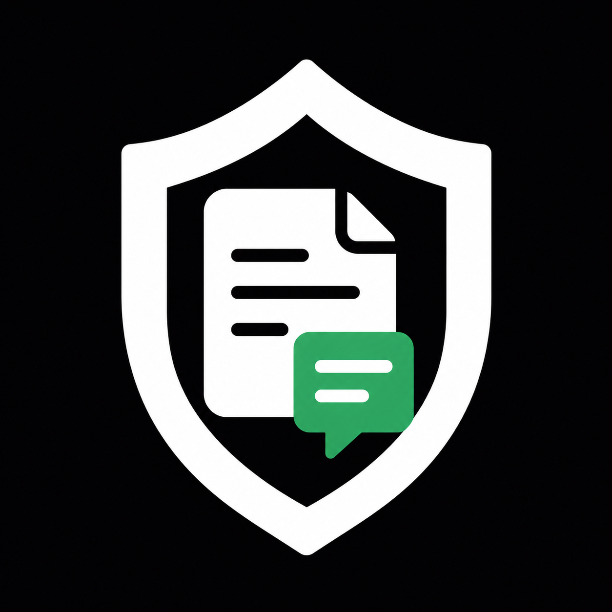
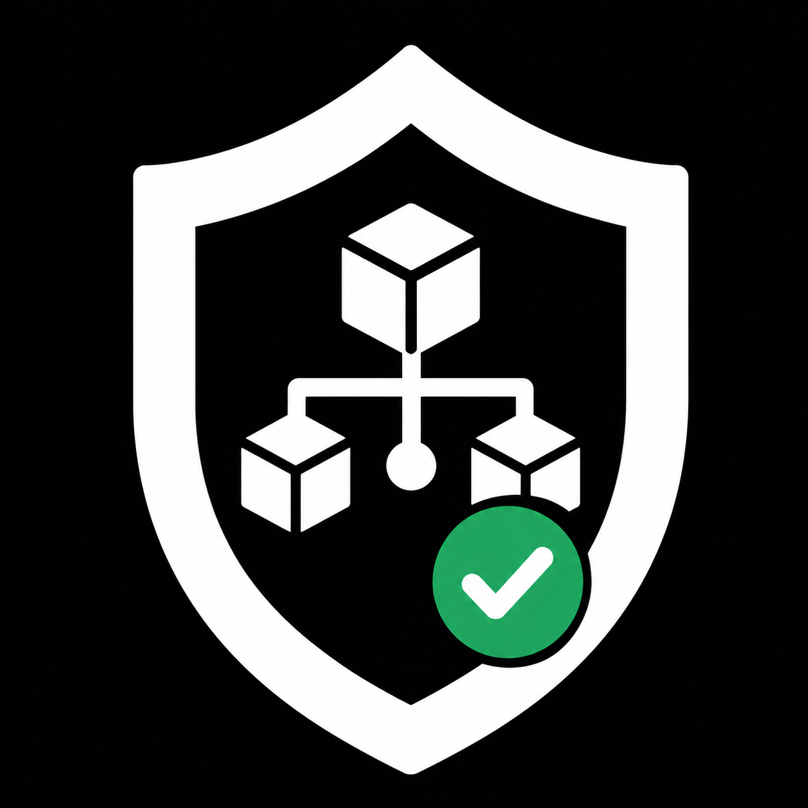

<div align="center">
  
  
  # 🛡️ AI Release Gatekeeper
  **The Multi-Agent Deployment Risk Orchestration Platform**

  [](https://opensource.org/licenses/MIT)
  [](https://agent.croo.network)
  [](https://croo.network)
  [](https://render.com)

  > *"Passing CI doesn't mean it's safe. AI Release Gatekeeper answers the only question that matters: **Is this release safe to ship?***"
</div>

---

## 📖 Table of Contents
- [Executive Summary](#-executive-summary)
- [The Orchestration Flow (A2A)](#-the-orchestration-flow-a2a)
- [Meet the Agents](#-meet-the-agents)
- [CAP Protocol Integration](#-cap-protocol-integration)
- [Feature Comparison](#-feature-comparison)
- [Commercial Value & Innovation](#-commercial-value--innovation)
- [Quick Start: Local & CROO Modes](#-quick-start-local--croo-modes)
- [Cloud Deployment (Render)](#-cloud-deployment-render)
- [Technical Stack](#-technical-stack)
- [Roadmap & Contributing](#-roadmap--contributing)

---

## 🚀 Executive Summary

Modern software releases fail because teams lack centralized deployment intelligence. CI/CD pipelines tell you if the code compiles, but they cannot tell you if the release will cause a production outage. 

**AI Release Gatekeeper** is a production-grade orchestration engine built on the **[CROO Network](https://croo.network)** using the **CROO Agent Protocol (CAP)**. Instead of relying on a single "mega-prompt" LLM, it demonstrates true **A2A (Agent-to-Agent) Composability**. 

One central Orchestrator dynamically hires **four independently deployed, specialized AI agents**, pays them in USDC on-chain, and aggregates their intelligence to compute **Rollback Probability**, **Blast Radius**, and a final **Deployment Confidence Score**.

---

## 🏗️ The Orchestration Flow (A2A)

The platform utilizes a concurrent fan-out/fan-in architecture governed by CAP.



---

## 🤖 Meet the Agents

The platform is powered by 5 distinct, monetizable agents. Each provider agent is an independent entity with its own wallet, pricing, and specialized LLM prompt.

<div align="center">

| Agent | Responsibility | Output Schema |
|:---:|---|---|
| <br>**Orchestrator** | **The Requester:** Hires sub-agents, orchestrates the CAP lifecycle, aggregates risk scoring, and hosts the FastAPI dashboard. | `ReleaseVerdict` |
| <br>**Repo Doctor** | **Provider:** Evaluates overall repository health, commit frequency, issue ratios, and CI hygiene. | `HealthScore` |
| <br>**Security Scanner** | **Provider:** Scans code diffs for secrets, SQL injections, and logic vulnerabilities. | `SecurityRisk` |
| <br>**PR Describer** | **Provider:** Semantically classifies PRs, detects breaking changes, and database migrations. | `SemanticSummary` |
| <br>**Dependency Auditor**| **Provider:** Audits modified manifests for vulnerable, abandoned, or dangerous packages. | `SupplyChainRisk`|

</div>

---

## 💎 Commercial Value & Innovation

This project was built for the **CROO Agent Hackathon**, perfectly targeting the core philosophy of the network:

1. **Monetizable Infrastructure:** The sub-agents are listed as independent services on the CROO Store. Other developers can hire our *Security Scanner* without needing the whole gatekeeper.
2. **Predictive Analytics:** It moves beyond generic summaries by calculating actionable metrics like `Rollback Probability` and `Blast Radius`.
3. **Fault-Tolerant Settlement:** Built strictly on the CAP state machine. Even if an LLM is rate-limited, agents utilize a fallback system to ensure valid schema delivery and atomic settlement.

---

## ⚡ CAP Protocol Integration

The platform deeply implements the `croo-sdk` for a flawless transactional lifecycle.

- **`negotiate_order()`:** Orchestrator queries the CROO network for the service price.
- **`pay_order()`:** Orchestrator locks USDC into the CAPVault escrow.
- **`accept_negotiation()` & `deliver_order()`:** Providers wait for the `ORDER_PAID` event, execute their heavy LLM inferences, and securely deliver the results back.
- **WebSocket Streaming:** Both requester and providers rely heavily on real-time event streaming (`NEGOTIATION_CREATED`, `ORDER_COMPLETED`) for rapid, concurrent execution.

---

## ⚖️ Feature Comparison

| Feature | Generic AI Reviewers | CI/CD (GitHub Actions) | **AI Release Gatekeeper** |
|---------|----------------------|------------------------|---------------------------|
| **Syntax Checking** | ❌ (Usually weak) | ✅ Perfect | ➖ Delegates to CI |
| **Logic & Context** | ✅ Good | ❌ None | ✅ **Excellent** |
| **Risk Prediction** | ❌ None | ❌ None | ✅ **Rollback & Blast Radius** |
| **Architecture** | Single Monolithic LLM | Static Scripts | ✅ **Decentralized A2A Swarm** |
| **Pricing Model** | Expensive Subscriptions | Usage-based compute | ✅ **Pay-per-Agent (0.01 USDC)** |

---

## 🚀 Quick Start: Local & CROO Modes

The system gracefully falls back to **Local Mode** for easy testing (running agents in-process), but natively supports **CROO Mode** for full A2A commerce.

### 1. Install Dependencies
```bash
git clone https://github.com/your-username/AI_Release_Gatekeeper.git
cd AI_Release_Gatekeeper
python -m venv venv
source venv/bin/activate
pip install -r requirements.txt
```

### 2. Configure Environment
```bash
cp .env.example .env
```
Edit `.env` to include:
- `GITHUB_TOKEN`: Read-only classic token (required to fetch PR diffs without rate-limiting).
- `LLM_API_KEY`: Groq, OpenAI, or Gemini key.
- `CROO_ORCHESTRATOR_KEY` & `CROO_*_SERVICE_ID`: (For CROO Mode).

### 3. Run the Platform
```bash
python run_orchestrator.py
```
Visit **http://localhost:8000** to access the dashboard. 

*(If running in CROO mode, start the providers in a separate terminal: `python run_agents.py`)*

---

## ☁️ Cloud Deployment (Render)

Deploy the entire platform on the **Render Free Tier**:

1. Create a new **Web Service** on Render connected to this repository.
2. **Build Command:** `pip install -r requirements.txt`
3. **Start Command:** `python run_agents.py & uvicorn api.app:app --host 0.0.0.0 --port $PORT`
4. Add your `.env` variables in the dashboard.
5. Deploy! Both the Orchestrator and Providers will run simultaneously.

*For comprehensive CROO agent setup, see our detailed [Deployment Guide](docs/deployment_guide.md).*

---

## 🛠️ Technical Stack

- **Backend / API:** FastAPI, Uvicorn, Python 3.10+
- **Agent Intelligence:** `llama-3.3-70b-versatile` (via Groq), OpenAI standard.
- **A2A Network:** `croo-sdk`, WebSocket Event Streaming, USDC Settlement.
- **Frontend:** Vanilla HTML/CSS/JS (Custom "Orange" Glassmorphism UI).
- **Persistence:** Local JSON file persistence (Ready for PostgreSQL).

---

## 🛣️ Roadmap & Contributing

- [x] Phase 1: A2A Orchestration & CAP Integration
- [x] Phase 2: Rollback Prediction Engine
- [ ] Phase 3: Automated autonomous rollback execution based on telemetry.
- [ ] Phase 4: Slack/Discord Integration for deployment approvals.

Contributions are welcome! Please open an issue or submit a pull request for any improvements or new agent capabilities.

---
<div align="center">
  <i>Built for the CROO Agent Hackathon 2026.</i>
</div>
